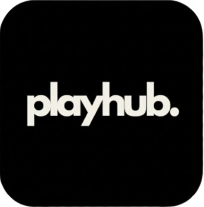
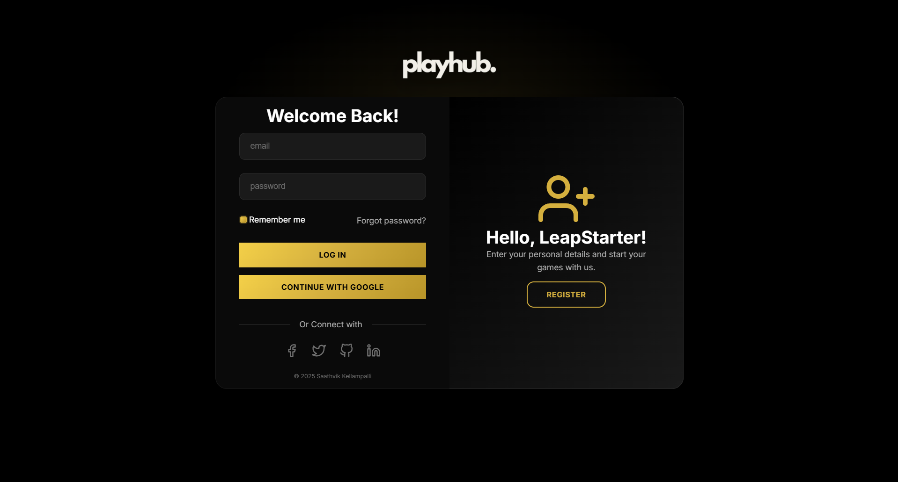
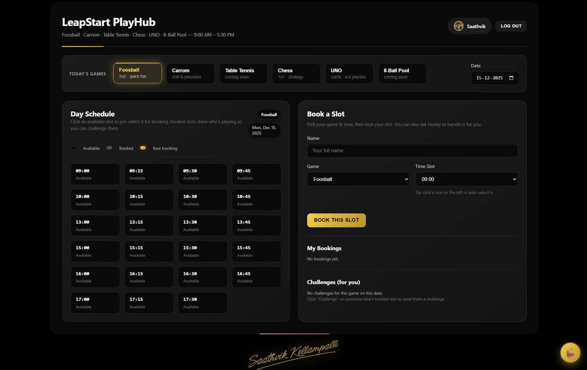
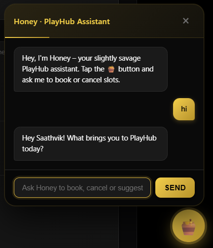

# PlayHub – Campus Game Planner

<div align="center">
  
</div>

PlayHub is a web-based game planner designed for students at LST. It enables students to book slots for foosball, carrom, chess, and UNO, send challenges to other players, and use an AI assistant named "Honey" to book or cancel slots using natural language.

**🚀 Live Demo:** [https://playhub-lst.netlify.app](https://playhub-lst.netlify.app)

---

## 📋 Features

### 🎮 Booking & Schedule
- **Daily schedule view** from 09:00 to 17:30 in 15-minute slots
- **Multiple games available:** Foosball, Carrom, Chess, UNO
  - *Coming soon:* Table Tennis, 8-Ball Pool
- **Smart slot states:**
  - ✅ Available
  - 🔒 Booked by someone else
  - ⭐ Your booking (highlighted)
- **Intelligent booking rules:**
  - 🚫 Class blocks (not bookable):
    - 11:00 – 13:00
    - 14:00 – 15:00
  - ⏱️ Maximum 2 consecutive slots per user per game per day
- **One-click booking:** Click any available slot to auto-fill the booking form

### 👥 Multi-User & Challenges
- **Firebase Authentication** for secure user login
- **Real-time updates** via Firestore
- **Challenge system:**
  - Challenge students who have booked slots
  - Track challenge status: `pending`, `accepted`, `declined`
  - Coordinate match timing with other players

### 🤖 Honey – AI Booking Assistant
- Floating chat widget powered by AI
- Natural language understanding via **Groq LLM API**
- Example commands:
  - *"Book foosball tomorrow at 4:15 for me."*
  - *"Cancel my chess booking today at 3:00."*
  - *"Suggest some slots for carrom after classes."*
- Intelligent responses with structured actions (book, cancel, suggest)

---

## 📸 Screenshots

### Login Page
<div align="center">
  
  <p><em>Clean and intuitive login interface with PlayHub branding</em></p>
</div>

### Dashboard
<div align="center">
  
  <p><em>Interactive schedule grid showing available slots and bookings</em></p>
</div>

### Honey AI Assistant
<div align="center">
  
  <p><em>Natural language booking with Honey, your AI assistant</em></p>
</div>

---

## 🏗️ Architecture

### Frontend
- **Static Single Page Application (SPA)**
- **Technologies:** HTML5, CSS3, Vanilla JavaScript
- **Pages:**
  - `index.html` – Login/landing page
  - `playhub.html` – Main booking dashboard

**Key Scripts:**
- `firebase-init.js` – Firebase configuration & initialization
- `auth.js` – Authentication and routing logic
- `playhub.js` – Core booking logic, schedule rendering, challenges, and Honey integration

### Backend
- **Firebase Firestore** (NoSQL database)
  - `users` – User profiles and metadata
  - `bookings` – Game bookings (one document per game/date/slot)
  - `challenges` – Challenge records between players
- **Firebase Authentication** – User login and profile management
- **Netlify Functions** (Serverless)
  - `netlify/functions/honey-assistant.js` – AI assistant endpoint
    - Receives chat context from frontend
    - Calls Groq's chat completions API
    - Returns structured JSON with actions and suggestions

### Data Models

**Booking Document:**
```json
{
  "uid": "user-id",
  "displayName": "Student Name",
  "game": "Foosball",
  "date": "2025-12-05",
  "slot": "09:15",
  "createdAt": "2025-12-04T10:00:00.000Z"
}
```

**Challenge Document:**
```json
{
  "fromUid": "challenger-id",
  "fromName": "Challenger Name",
  "toUid": "owner-id",
  "toName": "Slot Owner",
  "game": "Foosball",
  "date": "2025-12-05",
  "slot": "09:15",
  "status": "pending",
  "createdAt": "2025-12-04T10:05:00.000Z"
}
```

---

## 🛠️ Tech Stack

| Category | Technologies |
|----------|-------------|
| **Frontend** | HTML5, CSS3, JavaScript (ES6+) |
| **Authentication** | Firebase Authentication |
| **Database** | Firebase Firestore |
| **Hosting** | Netlify |
| **Serverless** | Netlify Functions |
| **AI/LLM** | Groq API |
| **Design** | Responsive CSS, Custom UI components |

---

## 🚀 Getting Started

### Prerequisites
- Node.js (v14 or higher)
- A Firebase account
- A Netlify account
- A Groq API key

### 1️⃣ Clone the Repository

```bash
git clone https://github.com/broskell/playhub.git
cd playhub
```

### 2️⃣ Firebase Setup

1. Create a new project at [Firebase Console](https://console.firebase.google.com)
2. Enable **Authentication** (Google Sign-In or Email/Password)
3. Enable **Firestore Database** (start in test mode, then configure security rules)
4. Add a **Web App** to your project
5. Copy the Firebase configuration

6. Update `firebase-init.js` with your config:

```javascript
const firebaseConfig = {
  apiKey: "API_KEY",
  authDomain: "AUTH_DOMAIN",
  projectId: "PROJECT_ID",
  storageBucket: "STORAGE_BUCKET",
  messagingSenderId: "MESSAGING_SENDER_ID",
  appId: "APP_ID"
};

firebase.initializeApp(firebaseConfig);
const auth = firebase.auth();
const db = firebase.firestore();
```

### 3️⃣ Netlify + Groq Setup

#### Create Netlify Site
1. Create a new site on [Netlify](https://app.netlify.com)
2. Connect to your Git repository or drag-and-drop the project folder
3. Ensure your project includes:

```
netlify.toml
netlify/
  functions/
    honey-assistant.js
```

4. Create `netlify.toml` in project root:

```toml
[build]
  publish = "."

[functions]
  directory = "netlify/functions"
```

#### Configure Environment Variables
In Netlify dashboard (Site settings → Environment variables):
- Groq API key
- Redeploy after saving

#### Honey Function Endpoint
The function exposes: `/.netlify/functions/honey-assistant`

**Request format:**
```json
{
  "message": "Book foosball tomorrow at 4pm",
  "today": "2025-12-04",
  "currentGame": "Foosball",
  "currentDate": "2025-12-05",
  "displayName": "Student Name",
  "history": []
}
```

**Response format:**
```json
{
  "reply": "Sure, I've booked Foosball tomorrow at 16:00 for you.",
  "action": "book",
  "game": "Foosball",
  "date": "2025-12-05",
  "time": "16:00",
  "suggestions": []
}
```

### 4️⃣ Local Development

**Option A: Simple Static Server (Recommended)**

```bash
# Using npx
npx serve .

# Or using Python
python -m http.server 8000

# Or using VS Code Live Server extension
# Right-click index.html → "Open with Live Server"
```

Open `http://localhost:3000/index.html` (or appropriate port)

**Option B: Netlify Dev (for local functions testing)**

```bash
npm install -g netlify-cli
netlify dev
```

Update `getHoneyEndpoint()` in `playhub.js` to point to local dev URL (usually `http://localhost:8888/.netlify/functions/honey-assistant`)

---

## 📁 Project Structure

```
playhub/
├── assets/                    # Images and logos
│   ├── bgless_sign.png
│   ├── html_logo.png
│   ├── playhub_dashboard_screenshot.png
│   ├── playhub_honey_screenshot.png
│   ├── playhub_html_logo.png
│   ├── playhub_login_screenshot.png
│   └── playhub_logo*.png
├── netlify/
│   └── functions/
│       └── honey-assistant.js # AI assistant serverless function
├── index.html                 # Login/landing page
├── login.css                  # Login page styles
├── login.js                   # Login page logic
├── playhub.html              # Main dashboard
├── playhub.css               # Dashboard styles
├── playhub.js                # Dashboard logic
├── firebase-init.js          # Firebase configuration
├── auth.js                   # Authentication logic
├── netlify.toml              # Netlify configuration
└── README.md                 # This file
```

---

## 📊 Current Status & Roadmap

### ✅ Completed
- Multi-user booking system with intelligent rules
- Visual schedule grid with real-time updates
- Challenge system for competitive play
- Production-ready Firestore structure
- AI assistant (Honey) integration
- Responsive design for mobile and desktop

### 🔮 Planned Enhancements
- 💬 Lightweight chat for challenge coordination
- 🏆 Leaderboards and player statistics
- ⚙️ Admin dashboard for game/slot management
- 📱 Progressive Web App (PWA) support
- 🔔 Push notifications for challenge updates
- 📊 Analytics dashboard for usage insights

---

## 🔒 Security Considerations

- Firebase Security Rules should be configured for production
- Environment variables (API keys) stored securely in Netlify
- User authentication required for all booking operations
- Input validation on both client and server side

**Example Firestore Security Rules:**

```javascript
rules_version = '2';
service cloud.firestore {
  match /databases/{database}/documents {
    match /bookings/{bookingId} {
      allow read: if request.auth != null;
      allow write: if request.auth != null && request.auth.uid == request.resource.data.uid;
    }
    match /challenges/{challengeId} {
      allow read: if request.auth != null;
      allow create: if request.auth != null;
      allow update: if request.auth != null && 
        (request.auth.uid == resource.data.fromUid || 
         request.auth.uid == resource.data.toUid);
    }
  }
}
```

---

## 🤝 Contributing

Contributions are welcome! Please feel free to submit a Pull Request.

1. Fork the repository
2. Create your feature branch (`git checkout -b feature/AmazingFeature`)
3. Commit your changes (`git commit -m 'Add some AmazingFeature'`)
4. Push to the branch (`git push origin feature/AmazingFeature`)
5. Open a Pull Request

---

## 📄 License

This project is licensed under the MIT License - see the [LICENSE](LICENSE) file for details.

---

## 👨‍💻 Author

**Saathvik Kellampalli**  
GitHub: [@broskell](https://github.com/broskell)  
LST Undergraduate

*PlayHub is a personal project exploring modern web app patterns, Firebase, serverless functions, and LLM-powered interfaces.*

---

## 🙏 Acknowledgments

- Firebase for backend infrastructure
- Netlify for hosting and serverless functions
- Groq for AI capabilities
- LST community for feedback and testing

---

## 📞 Support

For issues, questions, or suggestions:
- 🐛 [Open an issue](https://github.com/broskell/playhub/issues)
- 💬 Contact via GitHub [@broskell](https://github.com/broskell)
- 🌐 Visit [https://playhub-lst.netlify.app](https://playhub-lst.netlify.app)

---

<div align="center">
Made with ❤️ for the LST community
</div>